# 5G Application Function (AF) Microservice

## Overview

This repository contains a C++ microservice-based Application Function (AF) for 5G Core Networks. The AF serves as a crucial intermediary, connecting third-party applications and services with the capabilities of the 5G network, enabling enhanced functionalities such as dynamic Quality of Service (QoS) configuration, service function chaining, and data retrieval.

## Architecture

The AF is designed as a modular microservice application with distinct components responsible for specific functionalities:

1. **Northbound Interface Adapters**: Connect with external applications (ROS2, SFC MANO, etc.)
2. **AF Core Logic**: Orchestrates the overall functionality and routes requests
3. **Southbound Interface Handlers**: Communicate with 5G Core Network Functions (PCF, NEF, etc.)

### Modular Approach

The project follows a strict modular design philosophy to ensure scalability, maintainability, and testability.

*   **Decoupled Components**: Each component (Northbound Adapter, Core, Southbound Handler) operates independently, communicating via well-defined interfaces. This allows for replacing or upgrading individual components without affecting the rest of the system.
*   **Protocol Agnosticism**: The AF Core logic is isolated from external communication protocols. This applies to both **Northbound Adapters** (which can support HTTP, gRPC, MQTT) and **Southbound Handlers** (which translate generic internal commands to specific 3GPP N-interface calls). The core logic remains unchanged regardless of the external protocols used.
*   **Scalability**: Components can be deployed and scaled independently. For example, multiple Northbound Adapters can run in parallel to handle receiving high traffic loads, while a single AF Core instance manages the state.
*   **Testability**: The clear separation allows for focused unit testing of each module and simplified integration testing using mock interfaces.

### Communication & Dependency Injection

The project employs advanced architectural patterns to maintain loose coupling:

*   **Communication Abstraction**: A `CommunicationFactory` allows switching between `gRPC` (networked microservices) and `Direct` (in-process monolithic) communication modes via configuration, without changing component code.
*   **Dependency Injection (DI)**: A custom DI implementation (`ServiceContainer`) manages component lifecycles and dependencies, facilitating easy mocking and testing.

For more details, see [docs/architecture/communication-and-di.md](docs/architecture/communication-and-di.md).

### Architecture diagram

This diagram provides a high-level overview of the components and their relationships within your C++ microservice AF. Each box representing a microservice within the AF could potentially be a separate container in a deployment.

```mermaid
%% BEGIN DIAGRAM: docs/diagrams/architecture.mmd
graph RL
    %% Layout Direction: Right to Left

    %% --- 5G Network Domain ---
    subgraph Core [5G Core Network]
        direction TB
        %% Service Based Architecture components
        AUSF
        UDM
        UDR
        PCF
        NRF
        NEF
        BSF
        TSCTSF
        AMF
        SMF
        LMF
        GMLC

        %% Connect them to a bus line for visual grouping
        AUSF --- SBI_Bus[SBI]
        UDM --- SBI_Bus
        UDR --- SBI_Bus
        PCF --- SBI_Bus
        NRF --- SBI_Bus
        NEF --- SBI_Bus
        BSF --- SBI_Bus
        TSCTSF --- SBI_Bus
        LMF --- SBI_Bus
        GMLC --- SBI_Bus

        SBI_Bus --- AMF
        SBI_Bus --- SMF
    end

    %% --- Application Function Domain ---
    subgraph Phine_AF [phine.af]
        direction TB

        AF_Core[af.core]

        %% Northbound Interface Group
        subgraph NB_Interfaces [Northbound Adapters]
            direction TB
            App_Spec_API[App-specific API]
            TSN_Adapter[TSN]
            QoD_Adapter[Quality on Demand]
            Device_Location[Device Location]
            Traffic_Influence[Traffic Influence]
        end

        %% Southbound Interface Group
        subgraph SB_Interfaces [Southbound Handlers]
            direction TB
            PCF_Handler[PCF Handler]
            NEF_Handler[NEF Handler]
            BSF_Handler[BSF Handler]
            TSCTSF_Handler[TSCTSF Handler]
            AMF_Handler[AMF Handler]
            LMF_Handler[LMF Handler]
            GMLC_Handler[GMLC Handler]
            UDR_Handler[UDR Handler]
        end

        %% Internal Wiring
        App_Spec_API --- AF_Core
        TSN_Adapter --- AF_Core
        QoD_Adapter --- AF_Core
        Device_Location --- AF_Core
        Traffic_Influence --- AF_Core
        AF_Core --- PCF_Handler
        AF_Core --- NEF_Handler
        AF_Core --- BSF_Handler
        AF_Core --- TSCTSF_Handler
        AF_Core --- AMF_Handler
        AF_Core --- LMF_Handler
        AF_Core --- GMLC_Handler
        AF_Core --- UDR_Handler
    end

    subgraph Data_Plane [Data Plane]
        direction RL

        subgraph RAN [RAN]
            direction RL
            gNB -- "Virtual Air Interface" --> UE
            gNB[gNB]
            UE[UE]
        end

        subgraph DN [Data Network]
            direction RL
            UPF[UPF]
            App_DN[Application]
            %% Inverted for RL: App_DN (Right) -> UPF (Left)
            App_DN -- N6 --> UPF
        end

        App_Client[Application Client]

        %% Connections within Data Plane
        UE --- App_Client
        %% Inverted for RL: UPF (Right) -> gNB (Left)
        UPF -- N3 --> gNB
    end

    %% Connections between Network Domains
    AMF -- N1/N2 --> gNB
    UPF -- N4 --> SMF

    %% --- Application & Management Domain ---
    App_Mgmt[Application Management]
    App_Mgmt -. Manage .-> App_DN

    %% --- External Interfaces ---

    %% Northbound Requests
    App_Mgmt -- "gRPC, REST" --> App_Spec_API
    App_Mgmt -- "REST / NETCONF" --> TSN_Adapter
    App_Mgmt -- "CAMARA" --> QoD_Adapter
    App_Mgmt -- "CAMARA" --> Device_Location
    App_Mgmt -- "CAMARA" --> Traffic_Influence

    %% Southbound Requests
    PCF_Handler -- N5 --> PCF
    NEF_Handler -- N33 --> NEF
    BSF_Handler -- Nbsf --> BSF
    TSCTSF_Handler -- N52 --> TSCTSF
    AMF_Handler -- Namf --> AMF
    LMF_Handler -- Nlmf --> LMF
    GMLC_Handler -- Ngmlc --> GMLC
    UDR_Handler -- Nudr --> UDR

    %% --- Legend/Key ---
    subgraph Legend [" "]
        direction RL
        L1[Fully Implemented]
        L2[Partially Implemented]
        L3[Not Implemented]
    end

    L1 ~~~ PCF_Handler
    %% ===== STYLING =====

    %% --- 5G Core Network Styles (Orange/Gold theme with #f3a529) ---
    classDef coreSubgraph fill:#FEF3E0,stroke:#D4841C,stroke-width:2px
    classDef coreNode fill:#f3a529,stroke:#D4841C,stroke-width:2px,color:#000

    class Core coreSubgraph
    class AUSF,UDM,UDR,PCF,NRF,NEF,BSF,TSCTSF,AMF,SMF,SBI_Bus,LMF,GMLC coreNode

    %% --- Application Function Styles (Teal/Turquoise theme with #49c9c1) ---
    classDef afSubgraph fill:#D5F4F2,stroke:#2A9D8F,stroke-width:2px
    classDef afSubSubgraph fill:#B8EDE9,stroke:#359B91,stroke-width:2px

    class Phine_AF afSubgraph
    class NB_Interfaces,SB_Interfaces afSubSubgraph

    %% Implementation Status Styles for phine.af components
    %% Fully Implemented (Solid fill with #49c9c1)
    classDef afImplemented fill:#49c9c1,stroke:#2A9D8F,stroke-width:2px,color:#000

    %% Partially Implemented (Striped/Dashed border with lighter fill)
    classDef afPartial fill:#A8E6DF,stroke:#2A9D8F,stroke-width:2px,stroke-dasharray: 5 5,color:#000

    %% Not Implemented (Light fill with dashed border)
    classDef afNotImplemented fill:#E8F7F5,stroke:#2A9D8F,stroke-width:2px,stroke-dasharray: 10 5,color:#666

    %% Apply implementation status
    class AF_Core,QoD_Adapter,PCF_Handler afImplemented
    class App_Spec_API afPartial
    class TSN_Adapter,TSCTSF_Handler,BSF_Handler,NEF_Handler,Traffic_Influence,UDR_Handler,GMLC_Handler,LMF_Handler,AMF_Handler,Device_Location afNotImplemented

    %% --- Data Plane Styles (Deep Purple/Magenta theme with #741b47) ---
    classDef dataPlaneSubgraph fill:#F4E3ED,stroke:#741b47,stroke-width:2px
    classDef dataPlaneNode fill:#741b47,stroke:#4A0F2D,stroke-width:2px,color:#FFF
    classDef dataSubSubgraph fill:#E5C9D8,stroke:#5A1537,stroke-width:2px

    class Data_Plane dataPlaneSubgraph
    class UE,gNB,UPF,App_DN,App_Client dataPlaneNode
    class RAN,DN dataSubSubgraph

    %% --- Application Management Styles (Orange theme) ---
    classDef mgmtNode fill:#FFB74D,stroke:#E65100,stroke-width:2px,color:#000

    class App_Mgmt mgmtNode

    %% --- Legend Styles ---
    classDef legendBox fill:#FFFFFF,stroke:#666,stroke-width:1px,color:#000

    class Legend legendBox
    class L1 afImplemented
    class L2 afPartial
    class L3 afNotImplemented
%% END DIAGRAM: docs/diagrams/architecture.mmd
```



## Project Structure

```
/phine.af/
|-- common/               # Shared utilities, models, and frameworks
|-- northbound/           # Northbound interface adapters
|-- af_core/              # Core orchestration logic
|-- southbound/           # 5G Core Network interface handlers
|-- build/                # Build scripts and configuration
|-- tests/                # Test suites
|-- docs/                 # Documentation
|-- config/               # Configuration files
```

## Documentation

This repo includes an MkDocs site configuration in [mkdocs.yml](mkdocs.yml) with content under [docs/](docs/).

```bash
pip install mkdocs
mkdocs serve
```

See [docs/README.md](docs/README.md) for details.

## Getting started

- Quickstart (Docker Compose + sample request): [docs/getting-started/quickstart.md](docs/getting-started/quickstart.md)
- Prerequisites: [docs/getting-started/prerequisites.md](docs/getting-started/prerequisites.md)
- Build: [docs/getting-started/build.md](docs/getting-started/build.md)
- Run: [docs/getting-started/run.md](docs/getting-started/run.md)
- First request: [docs/getting-started/first-request.md](docs/getting-started/first-request.md)

**Important**: This project uses git submodules. After cloning, run:
```bash
git submodule update --init --recursive
```

For more request examples, see [af_core/README.md](af_core/README.md).

## Build & test (entry points)

- Build script: [build/scripts/ci_helper.sh build_all](build/scripts/ci_helper.sh)
- CI-like local validation: [build/scripts/ci_helper.sh](build/scripts/ci_helper.sh)
- Compose environments (build/test): [docs/operations/docker-compose.md](docs/operations/docker-compose.md)
- Testing guide: [docs/development/testing.md](docs/development/testing.md)

## Building

The project supports two deployment modes: **microservice** (default) and **bundled** (single binary/container). Both share the same codebase — the mode is selected at build time.

### Prerequisites

| Dependency | Version | Install |
|------------|---------|---------|
| CMake | ≥ 3.14 | `apt install cmake` |
| gRPC + Protobuf | 1.72.x | See [build/cmake/FindgRPC.cmake](build/cmake/FindgRPC.cmake) or use `phinetech/grpc-builder` |
| OpenSSL | 3.0+ | `apt install libssl-dev` |
| Boost | 1.74+ | `apt install libboost-all-dev` |
| nghttp2 / nghttp2-asio | 1.65+ | Built from source (see Dockerfiles) |
| spdlog | any | `apt install libspdlog-dev` |
| yaml-cpp | any | `apt install libyaml-cpp-dev` |
| nlohmann_json | 3.11.2 | `apt install nlohmann-json3-dev` |
| OAI CN5G Common | latest | `phinetech/oai-cn5g-common-src` Docker image |

> **Tip**: The easiest way to get all dependencies is to extract them from the builder Docker images (see Docker build below).

---

### Microservice build (individual components)

Each component builds independently and communicates over gRPC.

**1. Build common libraries:**
```bash
mkdir -p build-output && cd build-output
cmake .. -DCMAKE_BUILD_TYPE=Release
make -j$(nproc)
```

**2. Build a specific component:**
```bash
make af_core          # Core orchestrator
make api_server       # Northbound HTTP/2 API
make pcf_server       # Southbound PCF handler
```

**Run each service separately:**
```bash
./bin/af_core     --config af_core/config/af_core.yaml
./bin/api_server  --config northbound/api_component/config/api_adapter.yaml
./bin/pcf_server  --config southbound/pcf_handler/config/pcf_handler.yaml
```

---

### Bundled build (single binary)

All three components run in one process using direct (in-memory) communication. No gRPC between components.

**1. Install OAI CN5G Common libraries from Docker image (one-time):**
```bash
CID=$(docker create phinetech/oai-cn5g-common-src:latest)
sudo docker cp "$CID:/usr/local/lib/libCONFIG.a"       /usr/local/lib/
sudo docker cp "$CID:/usr/local/lib/libPCF.a"           /usr/local/lib/
sudo docker cp "$CID:/usr/local/lib/libCOMMON_MODEL.a"  /usr/local/lib/
sudo docker cp "$CID:/usr/local/lib/libLOGGER.a"        /usr/local/lib/
sudo docker cp "$CID:/usr/local/lib/libNAS.a"           /usr/local/lib/
sudo docker cp "$CID:/usr/local/lib/libCOMMON.a"        /usr/local/lib/
sudo docker cp "$CID:/usr/local/lib/libUTILS.a"         /usr/local/lib/
sudo docker cp "$CID:/usr/local/lib/cmake/oai_cn5g_common" /usr/local/lib/cmake/
sudo docker cp "$CID:/usr/local/include/oai"            /usr/local/include/
docker rm "$CID"
```

**2. Configure and build:**
```bash
mkdir -p build-output && cd build-output
cmake .. -DCMAKE_BUILD_TYPE=Release -DBUILD_BUNDLED=ON
make -j$(nproc) af
```

**3. Run:**
```bash
./bin/af --config config/af.yaml
```

The unified config file [`config/af.yaml`](config/af.yaml) contains settings for all three components with `communication.type: direct`.

---

### Docker builds

Each service has its own Dockerfile for containerised deployment.

**Build individual service images:**
```bash
# Southbound PCF handler
docker build -f southbound/pcf_handler/Dockerfile -t af-pcf-handler .

# AF Core
docker build -f af_core/Dockerfile -t af-core .

# Northbound API
docker build -f northbound/api_component/Dockerfile -t af-api .
```

**Build the AF image (all-in-one):**
```bash
docker build -f Dockerfile -t af .
```

---

### Docker Compose environments

| File | Description |
|------|-------------|
| [docker-compose-free5gc-build.yaml](docker-compose/docker-compose-free5gc-build.yaml) | Microservice AF + free5gc core |
| [docker-compose-oai-build.yaml](docker-compose/docker-compose-oai-build.yaml) | Microservice AF + OAI core |
| [docker-compose-bundled.yaml](docker-compose/docker-compose-bundled.yaml) | **AF** (single container) + free5gc core |
| [docker-compose-build.yaml](docker-compose/docker-compose-build.yaml) | AF components only |

**Start the bundled stack:**
```bash
cd docker-compose
docker compose -f docker-compose-bundled.yaml build
docker compose -f docker-compose-bundled.yaml up
```

**Start the microservice stack (free5gc):**
```bash
cd docker-compose
docker compose -f docker-compose-free5gc-build.yaml build
docker compose -f docker-compose-free5gc-build.yaml up
```

## Development

- Submodule management: [docs/development/submodule-management.md](docs/development/submodule-management.md)
- Configuration guide: [docs/development/configuration.md](docs/development/configuration.md)
- Add a CAMARA API: [docs/development/add-camara-api.md](docs/development/add-camara-api.md)
- Add a southbound handler: [docs/development/add-southbound-handler.md](docs/development/add-southbound-handler.md)

## Contributing

See [docs/contributing.md](docs/contributing.md).

## License

TODO: Add a repository-level license.

Note: [southbound/oai-cn5g-common-src/LICENSE](southbound/oai-cn5g-common-src/LICENSE) exists for that imported component.
