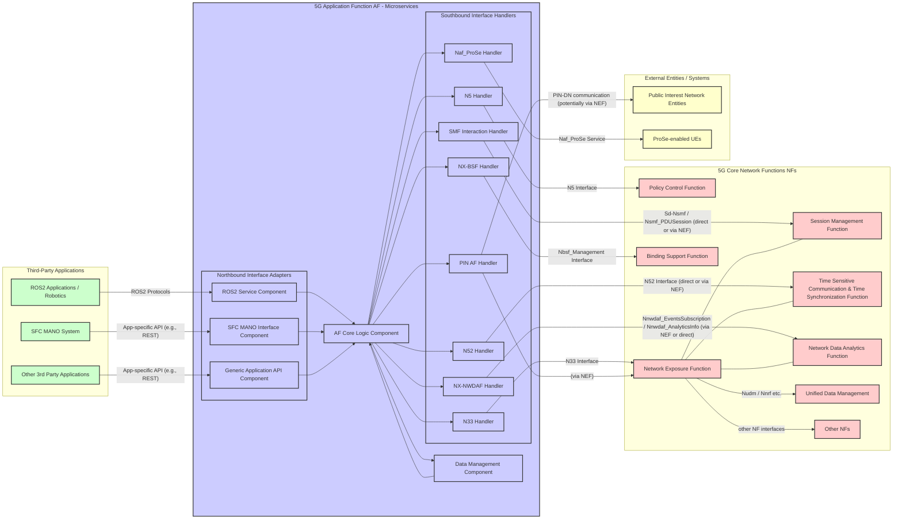

# 5G Application Function (AF) Microservice

## Overview

This repository contains a C++ microservice-based Application Function (AF) for 5G Core Networks. The AF serves as a crucial intermediary, connecting third-party applications and services with the capabilities of the 5G network, enabling enhanced functionalities such as dynamic Quality of Service (QoS) configuration, service function chaining, and data retrieval.

## Architecture

The AF is designed as a modular microservice application with distinct components responsible for specific functionalities:

1. **Northbound Interface Adapters**: Connect with external applications (ROS2, SFC MANO, etc.)
2. **AF Core Logic**: Orchestrates the overall functionality and routes requests
3. **Southbound Interface Handlers**: Communicate with 5G Core Network Functions (PCF, NEF, etc.)
4. **Data Management Component**: Manages application data, configurations, and state

### Architecture diagram

This diagram provides a high-level overview of the components and their relationships within your C++ microservice AF. Each box representing a microservice within the AF could potentially be a separate container in a deployment.



## Project Structure

```
/oai-cn5g-af/
|-- common/               # Shared utilities, models, and frameworks
|-- northbound/           # Northbound interface adapters
|-- af_core/              # Core orchestration logic
|-- southbound/           # 5G Core Network interface handlers
|-- data_management/      # Data and state management
|-- build/                # Build scripts and configuration
|-- tests/                # Test suites
|-- docs/                 # Documentation
|-- config/               # Configuration files
```


## Prerequisites

- C++17 compatible compiler (GCC 8+, Clang 7+)
- CMake 3.14+
- Protocol Buffers (protobuf) 3.6+
- gRPC 1.16+ (optional, for gRPC communication)
- Bash (for build scripts)

For development:
- Git
- A modern IDE (Visual Studio Code, CLion, etc.)

## Building the Application

### Using docker compose

```bash
# Start setup
docker compose -f docker-compose/docker-compose-oai-build.yaml up -d


```

### Using the Build Script

The easiest way to build the application is to use the provided build script:

```bash
# Navigate to the project root
cd oai-cn5g-af

# Make the build script executable if needed
chmod +x build/scripts/build_all.sh

# Build the application (Release mode)
./build/scripts/build_all.sh

# Or with options
./build/scripts/build_all.sh --clean --deps
```

### Build Options

The build script supports several options:

- `--clean`: Clean the build directory before building
- `--deps`: Re/Install dependencies
- `--debug`: Build in debug mode (with debug symbols)
- `--tests`: Build and run tests
- `--install`: Install the built libraries and executables
- `--help`: Show help message

### Manual Build with CMake

If you prefer to use CMake directly:

```bash
# Navigate to the project root
cd oai-cn5g-afs

# Create and navigate to build directory
mkdir -p build-output
cd build-output

# Configure CMake
cmake -DCMAKE_BUILD_TYPE=Release ..

# Build
cmake --build . -- -j$(nproc)

# Optionally run tests
ctest

# Optionally install
cmake --install .
```

### Build Output

After a successful build:

- Compiled libraries will be in `build-output/lib/`
- Executables will be in `build-output/bin/`
- Generated protobuf/gRPC code will be in `build-output/generated/`

## Running the Application

*Note: This section will be expanded as the microservice components are implemented.*

## Testing Locally

### Quick Validation

Before pushing changes, run the local validation script to execute the same checks as CI/CD:

```bash
./.github/scripts/validate-locally.sh
```

This script will:
1. Check code quality (trailing whitespace, script permissions)
2. Build all components (AF Core, PCF Handler, API Component)
3. Build integration test suite
4. Run integration tests with Free5GC environment (~10-15 minutes)

### Viewing Test Results

Logs are saved to `/tmp/` for debugging:

```bash
# View build logs
tail -f /tmp/af-core-build.log
tail -f /tmp/pcf-handler-build.log

# View integration test logs
tail -f /tmp/integration-tests.log
```

### Running Specific Tests

```bash
cd docker-compose

# Run specific test suite
docker-compose -f docker-compose-test.yaml run --rm \
  -e GTEST_FILTER='QodIntegrationTest.*' \
  af_integration_tests

# Cleanup
docker-compose -f docker-compose-test.yaml down -v
```

## Development

### Code Structure

- **Common Code**: Shared utilities, models, and frameworks used across the application
- **Northbound Adapters**: Interface with third-party applications and translate their protocols
- **Core Logic**: Orchestrates request handling and manages AF state
- **Southbound Handlers**: Implement the 3GPP interfaces to 5G Core Network Functions
- **Data Management**: Handles data storage, caching, and retrieval

### Adding a New Component

1. Create a directory for your component
2. Add necessary source and header files
3. Create a CMakeLists.txt file for your component
4. Add your component to the root CMakeLists.txt
5. Update the build scripts if necessary

## Contributing

*Contribution guidelines will be added here*

## License

*License information will be added here*