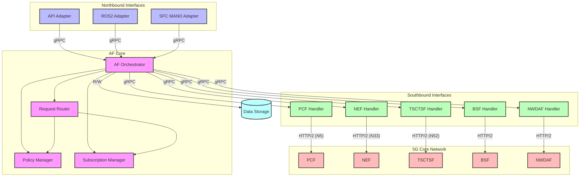
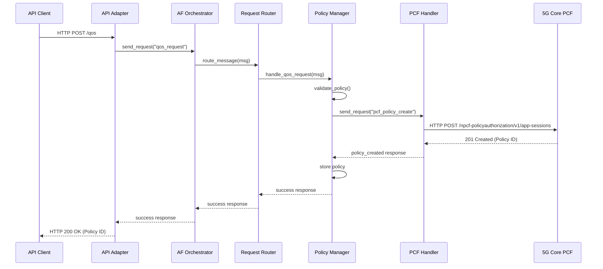
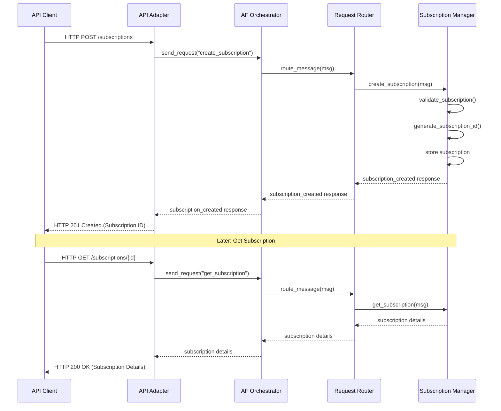
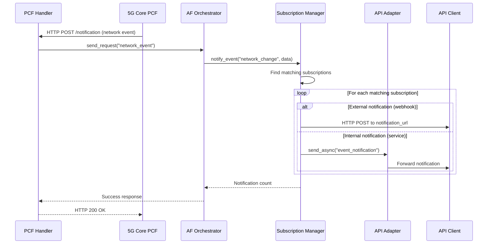

## AF Components 

The AF Core consists of the following main components:

### AF Orchestrator
- **Central coordinator** for all AF functionality
- Initializes and manages all other components
- Establishes communication channels with northbound and southbound interfaces
- Routes incoming messages to appropriate handlers

### Request Router
- Routes messages to appropriate handlers based on message type
- Provides a clean separation between message reception and processing
- Supports default handling for unknown message types

### Policy Manager
- Manages QoS policies and related network configurations
- Validates policy requests from applications
- Translates application requirements to network policies
- Interfaces with PCF to apply policies to the 5G network
- Maintains state of active policies

### Subscription Manager
- Handles event subscriptions from applications
- Manages subscription lifecycle (creation, retrieval, deletion)
- Delivers notifications when relevant events occur
- Supports both webhook-based and service-to-service notifications
- Handles filtering and subscription expiration



## Sequence diagram - QoS Policy Creation Flow



## Sequence diagram - Subscription Management Flow



## Sequence diagram - Event Notification Flow




## Key Message Types

| Message Type | Direction | Description |
|--------------|-----------|-------------|
| `qos_request` | Northbound→Core | Request to create/update QoS policy |
| `qos_success` | Core→Northbound | Successful QoS policy operation |
| `qos_error` | Core→Northbound | Error in QoS policy operation |
| `create_subscription` | Northbound→Core | Create new event subscription |
| `subscription_created` | Core→Northbound | Subscription successfully created |
| `get_subscriptions` | Northbound→Core | Request list of subscriptions |
| `subscriptions_list` | Core→Northbound | List of subscriptions |
| `get_subscription` | Northbound→Core | Request specific subscription |
| `subscription` | Core→Northbound | Subscription details |
| `delete_subscription` | Northbound→Core | Delete a subscription |
| `subscription_deleted` | Core→Northbound | Subscription successfully deleted |
| `event_notification` | Core→Northbound | Event notification to subscriber |
| `pcf_create_app_session` | Core→Southbound | Create policy in PCF |
| `pcf_update_app_session` | Core→Southbound | Update policy in PCF |
| `pcf_delete_app_session` | Core→Southbound | Delete policy in PCF |
| `network_event` | Southbound→Core | Network event notification |

This architecture enables the AF to effectively bridge between applications and the 5G core network, providing dynamic QoS management, network event notifications, and other advanced features.

## Testing Northbound Endpoints

We will use grpcurl running inside a docker container to simplify setup. Assuming the IP address for the af_core is `192.168.73.131`. The UERANSIM in the docker compose sets up a UE that has a static UE IP of 12.1.1.10.

```bash
docker run --rm --network host -v ./common/protos:/var/protos/ fullstorydev/grpcurl -plaintext \
  -proto message.proto \
  -import-path /var/protos \
  -d '{
    "message_type": "qos_request",
    "correlation_id": "12345",
    "payload": "'$(echo '{"ue_ipv4":"12.1.1.4"}' | base64)'",
    "metadata": {
      "source": "command_line",
      "priority": "high"
    }
  }' \
  192.168.70.141:50051 \
  af.proto.InternalCommunication/SendMessage
```