# Architecture overview

<!---
Got this layered architecture description from [DESIGN.md](../../DESIGN.md) section "High-Level Architecture".
-->

The system is divided into three logical layers:

- **Northbound**: protocol adapters that expose AF capabilities to external systems these spec "CAMARA APIs".
- **AF Core**: core orchestration and business logic for CAMARA services.
- **Southbound**: connectors/handlers that interact with 5G Core Network Functions.

## Design goals

- Modularity
- Clear separation of concerns
- Scalability
- Testability (via loose coupling / dependency injection)
- Extensibility

## High-level diagram

```mermaid
%% BEGIN DIAGRAM: docs/diagrams/architecture.mmd
graph RL
    %% Layout Direction: Right to Left

    %% --- 5G Network Domain ---
    subgraph Core [5G Core Network]
        direction TB
        %% Service Based Architecture components
        AUSF
        UDM
        UDR
        PCF
        NRF
        NEF
        BSF
        TSCTSF
        AMF
        SMF
        LMF
        GMLC

        %% Connect them to a bus line for visual grouping
        AUSF --- SBI_Bus[SBI]
        UDM --- SBI_Bus
        UDR --- SBI_Bus
        PCF --- SBI_Bus
        NRF --- SBI_Bus
        NEF --- SBI_Bus
        BSF --- SBI_Bus
        TSCTSF --- SBI_Bus
        LMF --- SBI_Bus
        GMLC --- SBI_Bus

        SBI_Bus --- AMF
        SBI_Bus --- SMF
    end

    %% --- Northbound Adapters (External) ---
    subgraph NB_Adapters [Northbound Adapters]
        direction TB
        TSN_Adapter_Ext[TSN CNC gateway]
        QoD_Adapter_Ext["QoS Adapters (e.g., ROS2 gateway)"]
        Device_Location_Ext[Device Location]
        Traffic_Influence_Ext[Traffic Influence]
    end

    %% --- Application Function Domain ---
    subgraph Phine_AF [phine.af]
        direction TB

        AF_Core[af.core]

        %% Northbound Interface Group
        subgraph NB_Interfaces [Northbound Handlers]
            direction TB
            App_Spec_API[App-specific API]
            TSN_Adapter[TSN]
            QoD_Adapter[Quality on Demand]
            Device_Location[Device Location]
            Traffic_Influence[Traffic Influence]
        end

        %% Southbound Interface Group
        subgraph SB_Interfaces [Southbound Handlers]
            direction TB
            PCF_Handler[PCF Handler]
            NEF_Handler[NEF Handler]
            BSF_Handler[BSF Handler]
            TSCTSF_Handler[TSCTSF Handler]
            AMF_Handler[AMF Handler]
            LMF_Handler[LMF Handler]
            GMLC_Handler[GMLC Handler]
            UDR_Handler[UDR Handler]
        end

        %% Internal Wiring
        App_Spec_API --- AF_Core
        TSN_Adapter --- AF_Core
        QoD_Adapter --- AF_Core
        Device_Location --- AF_Core
        Traffic_Influence --- AF_Core
        AF_Core --- PCF_Handler
        AF_Core --- NEF_Handler
        AF_Core --- BSF_Handler
        AF_Core --- TSCTSF_Handler
        AF_Core --- AMF_Handler
        AF_Core --- LMF_Handler
        AF_Core --- GMLC_Handler
        AF_Core --- UDR_Handler
    end

    subgraph Data_Plane [Data Plane]
        direction RL

        subgraph RAN [RAN]
            direction RL
            gNB -- "Virtual Air Interface" --> UE
            gNB[gNB]
            UE[UE]
        end

        subgraph DN [Data Network]
            direction RL
            UPF[UPF]
            App_DN[Application]
            %% Inverted for RL: App_DN (Right) -> UPF (Left)
            App_DN -- N6 --> UPF
        end

        App_Client[Application Client]

        %% Connections within Data Plane
        UE --- App_Client
        %% Inverted for RL: UPF (Right) -> gNB (Left)
        UPF -- N3 --> gNB
    end

    %% Connections between Network Domains
    AMF -- N1/N2 --> gNB
    UPF -- N4 --> SMF

    %% --- Application & Management Domain ---
    App_Mgmt[Application Management]
    App_Mgmt -. Manage .-> App_DN

    %% --- External Interfaces ---

    %% Northbound Requests (App Management to Adapters)
    App_Mgmt -- "gRPC, REST" --> App_Spec_API
    App_Mgmt --> TSN_Adapter_Ext
    App_Mgmt --> QoD_Adapter_Ext
    App_Mgmt --> Device_Location_Ext
    App_Mgmt --> Traffic_Influence_Ext

    %% Northbound Adapters to Handlers
    TSN_Adapter_Ext -- "REST / NETCONF" --> TSN_Adapter
    QoD_Adapter_Ext -- "CAMARA" --> QoD_Adapter
    Device_Location_Ext -- "CAMARA" --> Device_Location
    Traffic_Influence_Ext -- "CAMARA" --> Traffic_Influence

    %% Southbound Requests
    PCF_Handler -- N5 --> PCF
    NEF_Handler -- N33 --> NEF
    BSF_Handler -- Nbsf --> BSF
    TSCTSF_Handler -- N52 --> TSCTSF
    AMF_Handler -- Namf --> AMF
    LMF_Handler -- Nlmf --> LMF
    GMLC_Handler -- Ngmlc --> GMLC
    UDR_Handler -- Nudr --> UDR

    %% --- Legend/Key ---
    subgraph Legend [" "]
        direction RL
        L1[Fully Implemented]
        L2[Partially Implemented]
        L3[Not Implemented]
    end

    L1 ~~~ PCF_Handler
    %% ===== STYLING =====

    %% --- 5G Core Network Styles (Orange/Gold theme with #f3a529) ---
    classDef coreSubgraph fill:#FEF3E0,stroke:#D4841C,stroke-width:2px
    classDef coreNode fill:#f3a529,stroke:#D4841C,stroke-width:2px,color:#000

    class Core coreSubgraph
    class AUSF,UDM,UDR,PCF,NRF,NEF,BSF,TSCTSF,AMF,SMF,SBI_Bus,LMF,GMLC coreNode

    %% --- Application Function Styles (Teal/Turquoise theme with #49c9c1) ---
    classDef afSubgraph fill:#D5F4F2,stroke:#2A9D8F,stroke-width:2px
    classDef afSubSubgraph fill:#B8EDE9,stroke:#359B91,stroke-width:2px

    class Phine_AF afSubgraph
    class NB_Interfaces,SB_Interfaces afSubSubgraph
    class NB_Adapters afSubSubgraph

    %% Implementation Status Styles for phine.af components
    %% Fully Implemented (Solid fill with #49c9c1)
    classDef afImplemented fill:#49c9c1,stroke:#2A9D8F,stroke-width:2px,color:#000

    %% Partially Implemented (Striped/Dashed border with lighter fill)
    classDef afPartial fill:#A8E6DF,stroke:#2A9D8F,stroke-width:2px,stroke-dasharray: 5 5,color:#000

    %% Not Implemented (Light fill with dashed border)
    classDef afNotImplemented fill:#E8F7F5,stroke:#2A9D8F,stroke-width:2px,stroke-dasharray: 10 5,color:#666

    %% Apply implementation status
    class AF_Core,QoD_Adapter,PCF_Handler afImplemented
    class App_Spec_API afPartial
    class TSN_Adapter,TSCTSF_Handler,BSF_Handler,NEF_Handler,Traffic_Influence,UDR_Handler,GMLC_Handler,LMF_Handler,AMF_Handler,Device_Location afNotImplemented

    %% Apply styles to external northbound adapters
    class App_Spec_API_Ext afPartial
    class TSN_Adapter_Ext,Device_Location_Ext,Traffic_Influence_Ext afNotImplemented

    %% --- Data Plane Styles (Deep Purple/Magenta theme with #741b47) ---
    classDef dataPlaneSubgraph fill:#F4E3ED,stroke:#741b47,stroke-width:2px
    classDef dataPlaneNode fill:#741b47,stroke:#4A0F2D,stroke-width:2px,color:#FFF
    classDef dataSubSubgraph fill:#E5C9D8,stroke:#5A1537,stroke-width:2px

    class Data_Plane dataPlaneSubgraph
    class UE,gNB,UPF,App_DN,App_Client dataPlaneNode
    class RAN,DN dataSubSubgraph

    %% --- Application Management Styles (Orange theme) ---
    classDef mgmtNode fill:#FFB74D,stroke:#E65100,stroke-width:2px,color:#000

    class App_Mgmt mgmtNode

    %% --- Legend Styles ---
    classDef legendBox fill:#FFFFFF,stroke:#666,stroke-width:1px,color:#000

    class Legend legendBox
    class L1 afImplemented
    class L2 afPartial
    class L3 afNotImplemented
%% END DIAGRAM: docs/diagrams/architecture.mmd
```

<!---
Note: the diagram content is sourced from `docs/diagrams/architecture.mmd` and synced into this page.
-->
