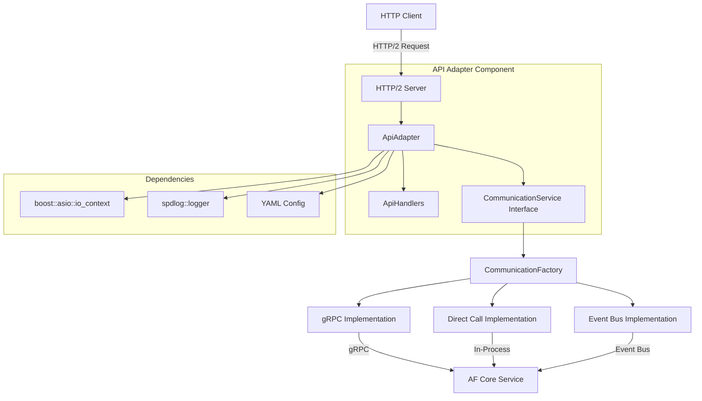

# 5G AF Northbound API Component

This component provides an HTTP/2 RESTful API for third-party applications to interact with the 5G Application Function (AF).

## Features

- HTTP/2 support using nghttp2::asio_http2
- TLS encryption support (configurable)
- Flexible configuration using YAML
- JSON-based APIs for QoS management and event subscriptions
- Clean separation of concerns with adapter and handlers pattern

## Building

### Prerequisites

- C++17 compliant compiler (GCC 9+ or Clang 10+)
- CMake 3.10+
- Boost libraries (system, thread)
- OpenSSL
- nghttp2 with ASIO bindings
- spdlog
- nlohmann_json
- yaml-cpp

### Compilation

```bash
mkdir -p build && cd build
cmake ..
make -j$(nproc)
```

### Components Diagram



### Sequence Diagram

```
sequenceDiagram
    participant Client as HTTP Client
    participant Server as HTTP/2 Server
    participant ApiAdapter as ApiAdapter
    participant ApiHandlers as ApiHandlers
    participant CommService as CommunicationService<br>(Abstract Interface)
    participant CommImpl as Communication<br>Implementation<br>(gRPC/Direct/Event Bus)
    participant AfCore as AF Core
    
    Client->>Server: HTTP/2 Request (e.g., POST /qos)
    Server->>ApiAdapter: Route request
    ApiAdapter->>ApiHandlers: Handle specific endpoint
    
    Note over ApiHandlers: Process request body
    
    ApiHandlers->>ApiHandlers: Create message with correlation ID
    ApiHandlers->>CommService: send_request("af_core", message)
    CommService->>CommImpl: Implementation-specific message passing
    CommImpl->>AfCore: Forward message to AF Core
    
    AfCore->>CommImpl: Response message
    CommImpl->>CommService: Forward response
    CommService->>ApiHandlers: Return response
    
    Note over ApiHandlers: Process response
    
    ApiHandlers->>Server: HTTP response (JSON)
    Server->>Client: HTTP/2 Response
```