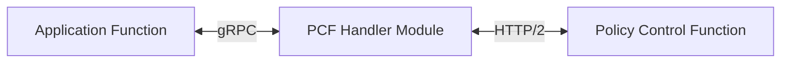
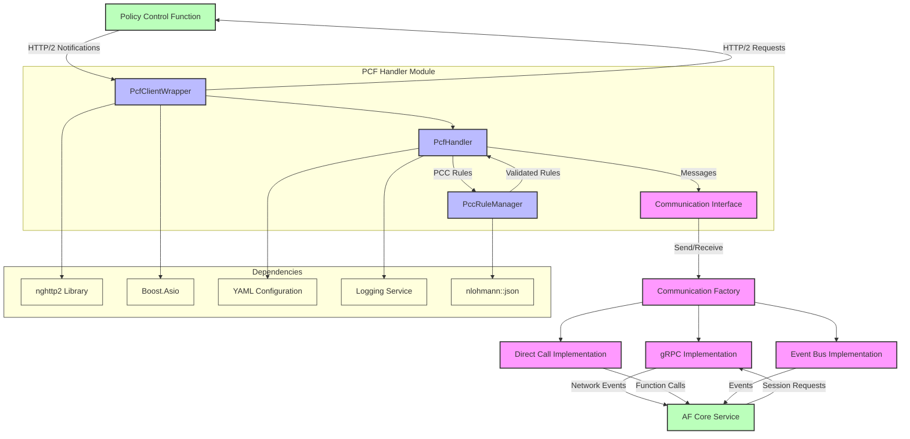
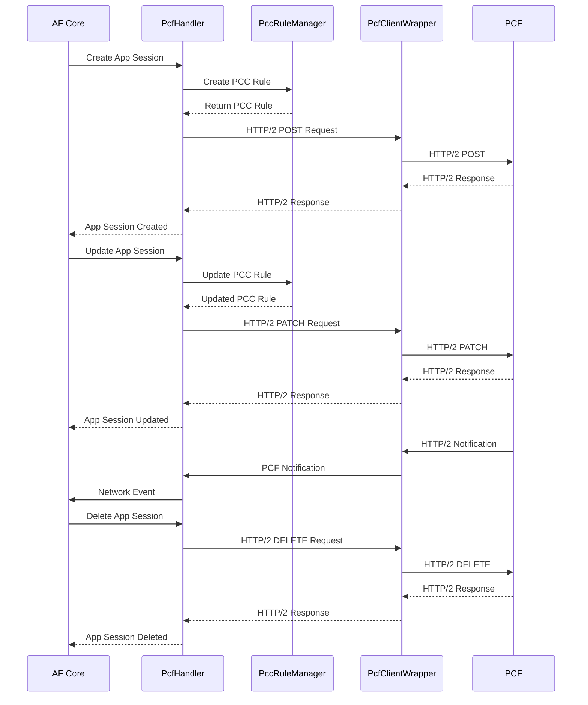

# PCF Handler Module

[](LICENSE)

## Overview

The PCF Handler Module provides an interface between the Application Function (AF) and the 5G Policy Control Function (PCF). It enables applications to influence QoS parameters, traffic steering policies, and charging rules in a 5G network through the Npcf_PolicyAuthorization API.



## Features

- Create, update, delete, and query application sessions with the PCF
- Create and manage PCC (Policy and Charging Control) rules
- Support for media component handling for QoS requirements
- HTTP/2 communication with the PCF using native nghttp2
- Thread-safe operation
- Comprehensive logging
- Configurable through YAML configuration files

## Architecture

1. **PcfHandler**:
   - Main entry point for the PCF Handler module
   - Handles messages from AF Core
   - Orchestrates PCC rule creation and PCF communication
   - Maintains application session state
   - Forwards notifications to AF Core

2. **PccRuleManager**:
   - Creates and validates PCC rules
   - Converts between different formats (media components, app sessions)
   - Caches rules for efficient access
   - Manages rule IDs and validation logic

3. **PcfClientWrapper**:
   - Implements HTTP/2 communication with PCF using nghttp2
   - Handles connection establishment and maintenance
   - Manages request/response processing
   - Supports different HTTP methods (GET, POST, PATCH, DELETE)




## Building and Installation

### Using CMake

```bash
mkdir build
cd build
cmake ..
make
make install
```

### Using Docker

```bash
docker build -t pcf-handler .
docker run -p 50055:50055 -v /path/to/config:/etc/oai/af/southbound pcf-handler
```

## Configuration

Configuration is done through YAML files. The default configuration file is located at `/etc/oai/af/southbound/pcf_handler.yaml`.

Example configuration:

```yaml
pcf_handler:
  # PCF connection details
  pcf_base_url: "http://pcf:80/npcf-policyauthorization/v1"
  use_tls: false
  api_version: "v1"
  
  # Logging configuration
  logging:
    level: "info"
    console_output: true
    file_output: true
    file_path: "/app/logs/pcf_handler.log"
    
  # Communication configuration
  communication:
    server_address: "0.0.0.0"
    server_port: "50055"
    core_address: "af-core"
    core_port: "50051"
```

## Usage

### Message Flow

The PCF Handler processes the following message types:

1. **pcf_create_app_session**: Create a new application session with the PCF
2. **pcf_update_app_session**: Update an existing application session
3. **pcf_delete_app_session**: Delete an application session
4. **pcf_get_app_session**: Get information about an application session
5. **pcf_notification**: Handle notifications from the PCF



## PCF Handler Message Types

| Message Type | Protocol | Direction | Description |
|--------------|----------|-----------|-------------|
| `pcf_create_app_session` | gRPC | AF Core→PCF Handler | Request to create a new application session with PCF |
| `pcf_app_session_created` | gRPC | PCF Handler→AF Core | Confirmation of successful application session creation |
| `pcf_update_app_session` | gRPC | AF Core→PCF Handler | Request to update an existing application session |
| `pcf_app_session_updated` | gRPC | PCF Handler→AF Core | Confirmation of successful application session update |
| `pcf_delete_app_session` | gRPC | AF Core→PCF Handler | Request to delete an application session |
| `pcf_app_session_deleted` | gRPC | PCF Handler→AF Core | Confirmation of successful application session deletion |
| `pcf_get_app_session` | gRPC | AF Core→PCF Handler | Request to retrieve application session information |
| `pcf_app_session_info` | gRPC | PCF Handler→AF Core | Response containing application session details |
| `pcf_notification` | gRPC | PCF Handler→AF Core | Event notification from PCF (forwarded to AF Core) |
| `pcf_notification_ack` | gRPC | AF Core→PCF Handler | Acknowledgment of notification receipt |
| `pcf_error` | gRPC | PCF Handler→AF Core | Error response for any failed operation |
| `POST /app-sessions` | HTTP/2 | PCF Handler→PCF | Create new application session (Npcf_PolicyAuthorization API) |
| `PATCH /app-sessions/{appSessionId}` | HTTP/2 | PCF Handler→PCF | Update existing application session |
| `DELETE /app-sessions/{appSessionId}` | HTTP/2 | PCF Handler→PCF | Delete application session |
| `GET /app-sessions/{appSessionId}` | HTTP/2 | PCF Handler→PCF | Retrieve application session information |
| `POST /notification` | HTTP/2 | PCF→PCF Handler | Notification of policy or network events from PCF |

The PCF Handler acts as a translation layer between the AF Core service (using gRPC) and the 5G Core PCF function (using HTTP/2), handling QoS requirements, traffic steering policies, and application session management.


## Testing Northbound Endpoints

We will use grpcurl running inside a docker container to simplify setup. Assuming the IP address for the af_core is `192.168.73.131`

```bash
docker run --network host -v ./common/protos:/var/protos/ fullstorydev/grpcurl -plaintext \
  -proto message.proto \
  -import-path /var/protos \
  -d '{
    "message_type": "pcf_create_app_session",
    "correlation_id": "12345",
    "payload": "'$(echo '{"ue_ipv4":"12.0.0.2"}' | base64)'",
    "metadata": {
      "source": "command_line",
      "priority": "high"
    }
  }' \
  192.168.73.132:50055 \
  af.proto.InternalCommunication/SendMessage
```

## Contributing

We welcome contributions! Please see [CONTRIBUTING.md](CONTRIBUTING.md) for details on how to submit pull requests, report issues, and suggest features.

## License

This project is licensed under the Apache License 2.0 - see the [LICENSE](LICENSE) file for details.

## Acknowledgments

- The 3GPP 5G specifications, particularly [TS 29.514](https://portal.3gpp.org/desktopmodules/Specifications/SpecificationDetails.aspx?specificationId=3357) which defines the Npcf_PolicyAuthorization API
- The nghttp2 project for their excellent HTTP/2 implementation
- Contributors to all the dependencies that make this project possible